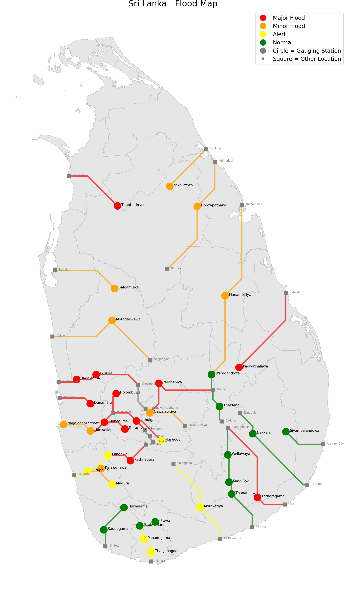

# #SriLanka 🇱🇰 - Flood Map

This is a schematic diagram of river water levels across gauging stations in Sri Lanka.

Data from [@dmc_lk](https://www.dmc.gov.lk/index.php).

Updated whenever new information is released by the DMC, usually every 3 hours.

